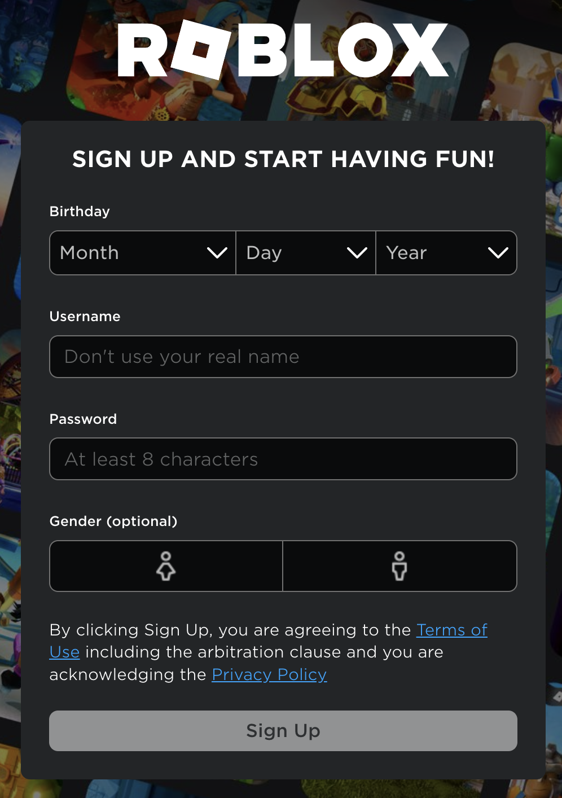
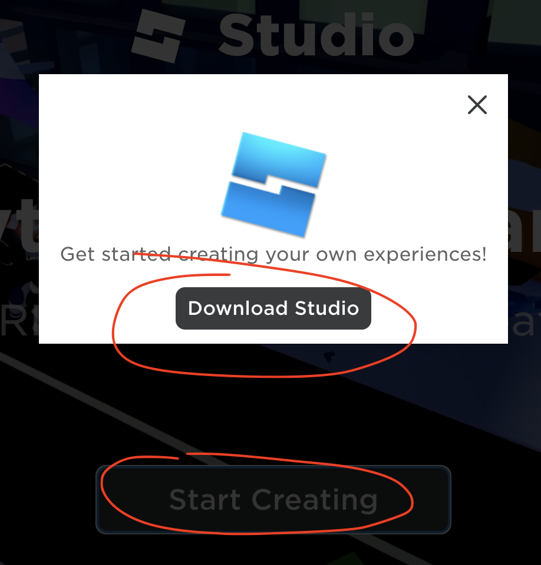

# Kom igång med Roblox Studio

> Innan du kan komma igång behöver du en dator. Både PC (Windows) och Apple (MacOS) fungerar lika bra. Ju snabbare och modernare dator du har dessto smidigare kommer verktyget att fungera. Roblox säger att det är bra om man har en dator som är yngre än 5 år 👶

### Installation av Roblox Studio

* 🛫 Skapa konto - [klicka här och skapa ett konto genom att klicka på Sign Up uppe till höger](https://www.roblox.com/create)

* 🧾 Följ instruktionerna

* 🖱️ Klicka på Start Creating och sedan Download Studio

* 🤖 Beroende på om det är Windows eller MacOS så ser det lite olika ut men det är som att installera ett "vanligt" program

💡 [Lite tips om hur du använder Roblox Studio](./resources/robloxstudio.md)