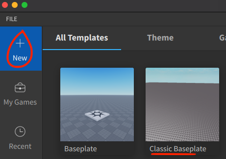
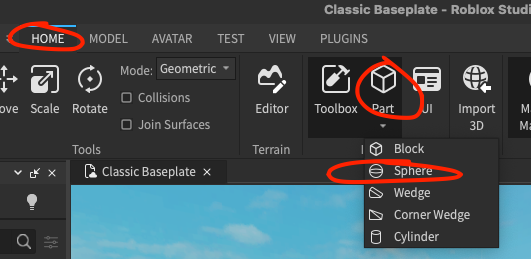
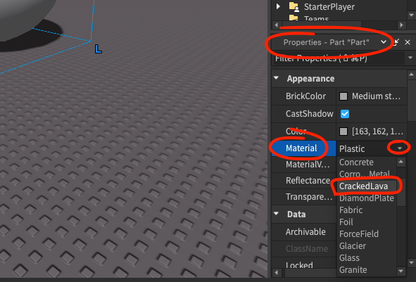
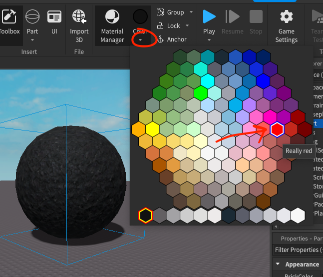

# 🤖 Labb - Jättefarlig röd lavaboll 🔥          

Uppgiften är att skapa ett spel vars enda syfte är att man ska undvika att gå in i den stora röda och jättefarliga lavabollen. Om man ändå gör det så dör man ☠️.

#### Del 1 - Skapa lavabollen
##### Skapa ny värld



##### Skapa en boll



##### Ändra bollens storlek (valfritt)


##### Ändra bollens material till "CrackedLava"



##### Ändra bollens färg till "Really red"



##### Testa spelet
Det är viktigt att lite då och då testa spelet så att allt fungerar som man tänkt sig


#### Del 2 - Gör lavabollen farlig (livsfarlig) ⚠️🔥

##### Döp bollen och lägg till scriptfil
Ändra namn från "Part" till "Lavaboll" sen klickar man med höger musknapp (högerklicka) och väljer "Insert object" och sedan "Script"


##### Lägg till dödskoden ☠️
Nedan är den kod som behövs för att bollen ska bli livsfarlig 😱, se klippet under koden för hur du får in den i spelet. Obs man kan klistra in koden genom att trycka ctrl + v / cmd + v eller som i klippet, genom högerklick
```lua
function onTouched(Obj)
	local h = Obj.Parent:FindFirstChild("Humanoid")
	if h then
		h.Health = 0
	end
end

script.Parent.Touched:Connect(onTouched)
```


##### Klara, färdiga, gibba! ✌️🎮
Nu borde din karaktör dö om den nuddar lavabollen
