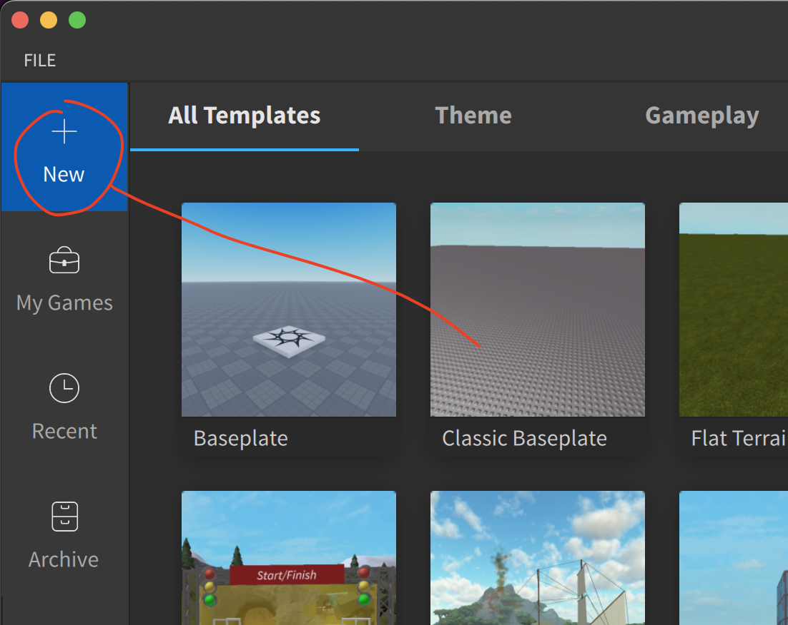

# Roblox Studio

> ℹ️ Roblox Studio är ett stort och komplicerat program. Nedan hittar du snabba tips för var du hittar grunderna men för att gå vidare föreslås att du söker på YouTube efter videos som går igenom Roblox Studio i detalj. Sök på "Roblox Studio Tutorial"

För att börja att skapa ett nytt spel i Roblox Studio, klicka på + New och seden väljer du vilken mall du vill ha. En bra mall för att testa lite olika saker är "Classic Baseplate"

Roblox Studio innehåller jättemycket olika knappar och menyer men de 3 viktigaste är:

#### 1 Toolbox
I Toolbox kan man hitta roliga saker såsom bilar eller dörrar som andra har byggt som man får använda sig av. Man kan söka på exempelvis "chair" så får man förslag på olika stolar

#### 2 Explorer
I Explorer hittar du en lista på alla dina saker. Om du exempelvis har lag in 100 dörrar från Toolbox så listas dessa här. Om man vill lägga till egen kod till sina objekt så gör man det här

#### 3 Properties
Om man vill ändra beteende på ett objekt, exempelvis göra en boll grön istället för röd så gör man detta i propertiesrutan

